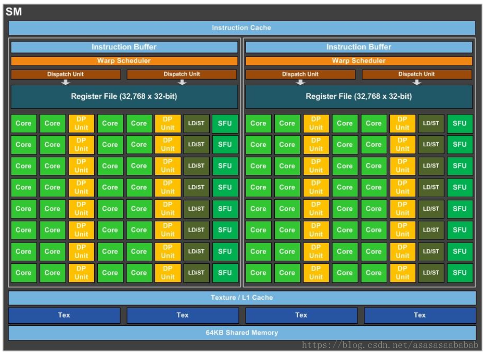

# CUDA ( Compute Unified Device Architecture ) 统一计算设备体系结构
* 地址：https://developer.nvidia.com/cuda-toolkit
* 当前最新版：11.2
* 目前使用版本是：10.1
* 所有的cuda版本地址：https://developer.nvidia.com/cuda-toolkit-archive
* 10.1文档地址：https://docs.nvidia.com/cuda/archive/10.1/
* CUDA架构介绍：https://blog.csdn.net/asasasaababab/article/details/80447254
* CUDA的API涵盖了：
    - CUDA Runtime API，运行时API，提供基本运行支持
    - CUDA Driver API，CUDA驱动API，与GPU设备交互的支持
    - CUDA Math API，数学API，基于CUDA实现的数学运算支持
    - cuBLAS，基于CUDA实现的BLAS库（Basic Linear Algebra Subprograms，基于线性代数的子程序），支持用户访问GPU资源，但是不会自动在交叉多GPU上并行（说白了是单卡执行）
    - NVBLAS，多GPU加速的blas版本，构建在cuBLAS之上
    - nvJPEG，提供高性能GPU加速的JPEG解码函数，用于DL(Deep learning)和大规模媒体场景的应用程序
    - cuFFT，基于CUDA的快速傅立叶变换支持
    - nvGRAPH，基于CUDA的图支持，高性能大规模数据分析图结构的支持
    - cuRAND，CUDA的随机数生成器
    - cuSPARSE，基于CUDA的稀疏矩阵支持
    - NPP，专注于图像和视频处理的加速库
    - NVRTC，CUDA C++的运行组件，他支持CUDA C++源代码以字符串的形式进行句柄创建
    - Thrust，CUDA的C++模板库，基于标准模板库STL。可以使用它和CUDA C实现互操作，以最少的编程工作实现高性能的并行应用程序
    - cuSOLVER，基于cuSPARSE和cuBLAS两个库实现的高级别稀疏矩阵库
* 其他
    - CUPTI，CUDA Profiling Tools Interface(CUPTI)，用于创建profiling和跟踪CUDA程序
* 工具
    - NVCC，CUDA的编译程序，接受常规的编译选项
    - CUDA-GDB，NVIDIA的调试工具（Linux 和 Mac），扩展自GNU-GDB
    - CUDA-MEMCHECK，是一套运行时工具，可以精确的检测出超出范围和未对齐内存访问的错误，检查分配泄漏，报告硬件故障和识别共享数据的危险访问
    - Nsight Eclipse Edition，提供给Eclipse的工具
    - Nsight Eclipse Plugins Installation Guide，提供给Eclipse的插件工具
    - Nsight Eclipse Plugins Edition，提供给Eclipse的插件工具
    - Nsight Compute，下一代CUDA程序的分析器，通过界面和命令行工具提供详细的性能指标和API调试
    - Profiler，CUDA程序的分析器，可以生成profile文件用以可视化分析，但是这个工具将会在未来发布版本中过期，推荐使用下一代分析工具NVIDIA Nsight Compute
* 重点
    - CUDA Runtime API
    - cuBLAS
    - Profiler
    - Nsight Compute
    - NVCC

# GPU构成
1. 显存（Global Memory）：显存是在GPU板卡上的DRAM，类似于CPU的内存，就是那堆DDR啊，GDDR5啊之类的。特点是容量大（可达32GB），速度慢，CPU和GPU都可以访问。
2. 计算单元（Streaming Multiprocessor）：执行计算的。每一个SM都有自己的控制单元（Control Unit），寄存器（Register），缓存（Cache），指令流水线（execution pipelines）
    - L1 Cache：Pascal架构上，L1 Cache和Texture已经合为一体（Unified L1/Texture Cache），作为一个连续缓存供给warp使用。
    - L2 Cache：用来做Global Memory的缓存，容量大，给整个GPU使用。
3. 主要记住，显卡的CUDA Core数量 = SM数量(Streaming Multiprocessor) * 64
    - 一个SM有2个SMP(SM Processing Block，它也是一个warp调度的单元)，而一个SMP有32个Core，所以通常一个warp调度单位是32个Core。32基本是固定数字
    - deviceQuery中看到Warp Size就是这里的32
    - CUDA Core的单精度的，DP Unit是双精度的（Double Precision）
        - 每个SMP有16个DP Unit
        - 所以单精度双精度在GP100显卡中的比例是2:1
    - 图灵(Turing、游戏级)、帕斯卡(PASCAL，游戏级)、开普勒(Kepler，游戏级)、麦克斯维尔(Maxwell，游戏级)、VOLTA(工业级)，都是GPU的架构代号。不同架构设计不同，例如游戏级的，更加重视渲染显示，所以重纹理等，新架构逐渐多了部分NN支持。工业级中的，支持了更多的NN计算，重视科学计算，所以配备的int8推理支持、fp16支持、TensorCore支持、DLA(DL Accelerate)支持，更大的显存以及更加快的通信速度，和更优秀的散热系统和7x24小时x365天连续运行支持

* GPU长相
    

        
    

* GPU内存
    

        
    

* GPU结构图
    

        
    

* Streaming Multiprocessor (SM)
    * 在GP100里，每一个SM有两个SM Processing Block（SMP），里边的绿色的就是CUDA Core，CUDA core也叫Streaming Processor（SP），这俩是一个意思。每一个SM有自己的指令缓存，L1缓存，共享内存。而每一个SMP有自己的Warp Scheduler、Register File等。要注意的是CUDA Core是Single Precision的，也就是计算float单精度的。双精度Double Precision是那个黄色的模块。所以一个SM里边由32个DP Unit，由64个CUDA Core，所以单精度双精度单元数量比是2:1。LD/ST 是load store unit，用来内存操作的。SFU是Special function unit，用来做cuda的intrinsic function的，类似于__cos()这种
    

        
    

* GPU内存架构
    

        
    

* GPU的架构
    

        
    

    

        
    

* 执行时的结构
    
    
        
    

* 执行方式
    

        
    

* 内存模型
    

        
    

* 内置变量：
    - https://docs.nvidia.com/cuda/archive/10.1/cuda-c-programming-guide/index.html#built-in-variables
    

        
    

* 函数执行空间指示符
    - \_\_device\_\_，函数执行在设备上
    - \_\_global\_\_，函数执行在设备上，但是调用在host上。定义核函数的符号
    - \_\_host\_\_，函数执行在host上，调用也在host上

* NVCC指令，简单情况下，直接替换g++的存在
* 语法：
    - 声明核函数
        - \_\_global\_\_ void func(args){}
        - 使用核函数，在GPU上运行：func<<<gridLayout, blockLayout, heapMemorySize, stream>>>(args);

